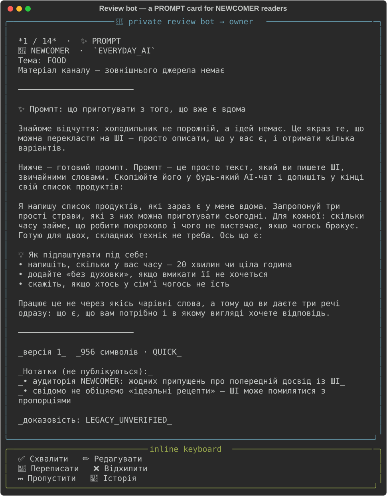
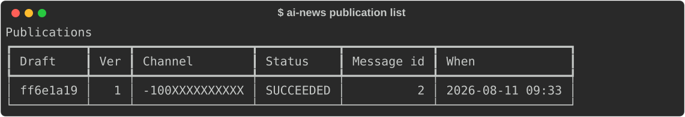
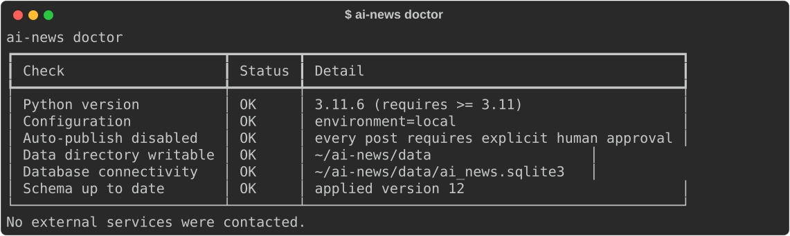
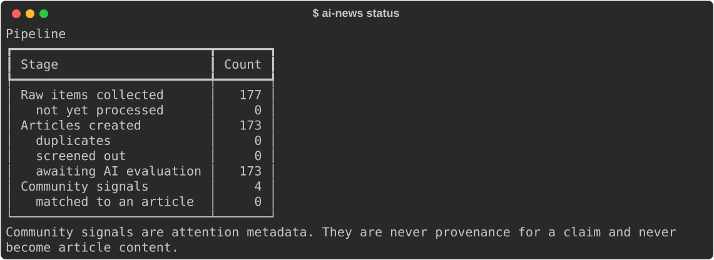
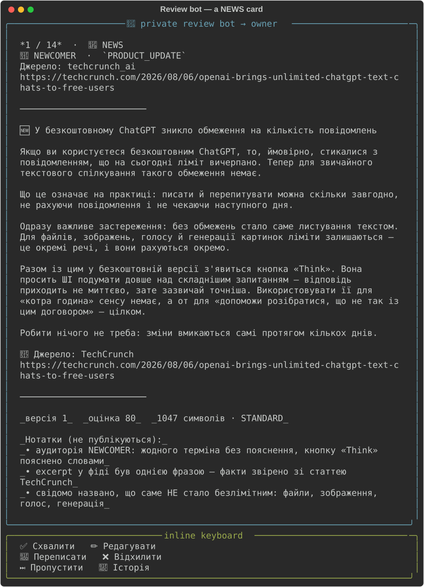
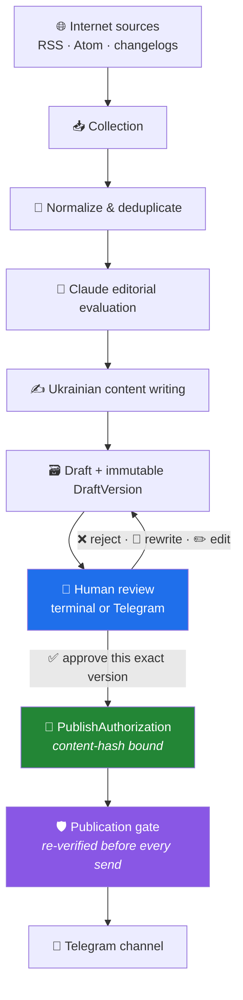
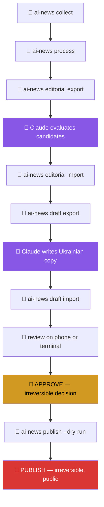

# 🤖 AI News Assistant — Human-in-the-Loop Telegram Editorial System

An AI-assisted **editorial pipeline** that discovers, evaluates, drafts, reviews and
safely publishes Ukrainian AI content to Telegram — built around a real channel,
[@learn_ai_easy](https://t.me/learn_ai_easy), written for ordinary readers rather than
engineers.

<div align="center">

`🐍 Python does the infrastructure` · `🧠 Claude Code does the editorial thinking` · `👤 a human approves every single post`

</div>

[](https://www.python.org/)
[](#-quality)
[](#-quality)
[](docs/safety.md)
[](https://docs.astral.sh/ruff/)

---

## 💡 What this actually is

It looks like a Telegram bot. It isn't.

It is a small **editorial system** with a hard safety boundary in the middle. Deterministic
Python handles everything that must be reliable — fetching, deduplication, provenance,
storage, delivery. A **Claude Code session acts as the editor and writer**, exchanging
JSON with the application. And no piece of content reaches the channel unless a person
has read that exact text and said yes to it.

> 🚫 **For prompts and use cases, there is no external LLM API and no API key.**
> Claude Code is the editorial *operator* for `PROMPT` and `TESTED_USE_CASE` content,
> not a dependency — and there is no auto-publish code path for that content; the
> setting that would enable one is rejected at startup.
>
> `NEWS` is the one exception, and it is opt-in and off by default: a narrow,
> [separately gated pipeline](#-automated-news-pipeline-opt-in-off-by-default) lets
> GitHub Actions call the Gemini API to select and write from official sources — every
> post still passes through the same validation and approval gate a human draft does.

The interesting engineering here is not "call a model and post the result". It is
everything that makes the answer to *"could something unapproved ever reach the channel?"*
provably **no** — immutable versions, content-hash-bound approvals, an unforgeable
authorization object, and a publication gate that re-checks reality at the last instant
before a network call.

---

## ✨ Key Features

| | |
|---|---|
| 📰 **Multi-source collection** | RSS, Atom and HTML changelogs with conditional GET and per-source fetch state |
| 🧹 **Normalization & deduplication** | Canonical URLs, text extraction, near-duplicate detection |
| 🔎 **Source provenance & trust tiers** | Every claim traces back to something findable |
| 🧠 **Claude-assisted editorial evaluation** | Candidates scored against a written rubric, not vibes |
| ✍️ **Ukrainian editorial writing workflow** | A documented voice, enforced by a style checker |
| 🌱 **NEWCOMER-first audience modelling** | Four audience tiers; jargon detection built in |
| ✨ **Source-backed tested prompts** | A prompt must rest on a real, findable demonstration |
| 💡 **Real-world use cases & lifehacks** | What someone actually did, retold — workflow and result |
| ✅ **Human-in-the-loop review** | Approve · Edit · Rewrite · Reject, from terminal or phone |
| 📱 **Private Telegram review bot** | Owner-only; strangers get four words and no data |
| 🔐 **Exact-DraftVersion approval** | Bound to a content hash covering the whole post bundle |
| 📸 **Rich media publication** | Photos, albums, captions — approved text never truncated |
| 📄 **PDF & document support** | Downloadable resources as their own recorded component |
| 💬 **First-comment publication** | Long prompts go to the linked discussion group |
| ♻️ **Idempotent publishing** | A unique partial index makes publish-exactly-once a database fact |
| 🧩 **Partial-failure recovery** | The main post is *never* re-sent; retries fill only the gaps |
| ❓ **UNCERTAIN-delivery protection** | An unknown outcome stops everything and calls a human |
| 🤐 **Token redaction everywhere** | Logs, output, exceptions, database, fixtures — all scrubbed |
| 📅 **Publication queue** | Schedule an exact approved version for an exact future moment |
| ⏰ **Local scheduler** | A stdlib process that publishes only what the owner queued |
| 🌍 **Europe/Kyiv scheduling** | UTC storage, channel-time display, DST refused rather than guessed |
| 🥬 **Freshness policy** | Per content type — news ages in hours, an explainer in a year |
| 😴 **Overdue safety** | A sleeping Mac never wakes up and blasts yesterday's news |
| 🗓 **Editorial calendar** | The week at a glance, in channel time, with what is uneven |
| ⚖️ **Content balance** | Mix, audience, streaks and gaps — targets, never quotas |
| 🔎 **Source & tool diversity** | Says when one publisher or one tool dominates the week |
| 🎯 **Series order safety** | Warns when part 3 is scheduled before part 2 |
| 💡 **Explainable slot suggestions** | Every point traced to a reason, no opaque score |
| 🤖 **Automated NEWS pipeline (opt-in, off by default)** | GitHub Actions + Gemini select and write from official sources; the same gate and validation as a human draft |
| 🧪 **1,946 automated tests** | Including a safety suite that cannot be skipped by accident |

---

## 🖼 What it looks like

**A real review card**, exactly as the private bot sends it — a `PROMPT` post written for
readers with no prior AI experience:



**The publication log** after a real end-to-end publication to the test channel:



**Health check** — read-only, contacts nothing:



<details>
<summary>📊 More: pipeline funnel and a NEWS review card</summary>





</details>

> 🧾 These are **genuine captures** of the real CLI and the real renderer running against
> the project database — not mockups. The private channel id, bot username and local
> filesystem paths are redacted. No fabricated Telegram screenshots appear anywhere in
> this repository.

---

## 🧬 Content model

Six kinds of post, because a reader wants different things from each:

| Type | What it gives the reader |
|---|---|
| 📰 **NEWS** | Something that happened, explained without jargon |
| ✨ **TESTED PROMPT** | A prompt to copy — backed by a real demonstration |
| 🛠 **TESTED USE CASE** | What someone actually did with AI: workflow and result |
| 💡 **REAL USER LIFEHACK** | A small practical trick that survived contact with reality |
| 🧠 **EXPLAINER** | One concept, no assumed background — *ШІ простими словами* |
| 📚 **RESOURCE** | Something to keep: a checklist, cheat sheet or collection |

And four audience tiers, so a post knows who it is speaking to:

```
🌱 NEWCOMER  →  🙂 BEGINNER  →  👤 GENERAL  →  🧩 TECH_CURIOUS
   never assumes                              comfortable with
   prior AI use                               technical framing
```

`NEWCOMER` is the default. If a post cannot be understood by someone who has never opened
an AI chat, it is not ready.

---

## 🏗 Architecture



Everything left of the blue box is assistance. Everything right of it is consequence.
📖 **[Full architecture →](docs/architecture.md)**

---

## 🔐 Safety by Design

This is the part worth reading if you only read one thing.

- 🚫 **No auto-approval, no auto-publish.** Enforced by a test that walks the CLI's
  registered options and fails if `--yes`, `--all` or `--approve-all` ever appears.
- 🔗 **Exact version + content hash binding.** The hash covers the *whole* post — text,
  comment, media and footer. Change any of it and the approval stops verifying.
- 🧊 **Immutable version history.** SQLite triggers, not convention. "What did I approve
  on Tuesday?" is always answerable.
- ✏️ **Editing invalidates approval.** A new version returns the draft to review, in the
  same transaction that writes it.
- 🎫 **An unforgeable authorization.** `PublishAuthorization` refuses to construct outside
  the gate. A publisher can receive one; it can never make one.
- ⏱ **Re-verification at the last instant.** Every check runs again immediately before
  the network call, because minutes or days may have passed since approval.
- 📑 **Source-backed prompt policy.** A prompt without a findable demonstration cannot be
  published — and *approval cannot override this*.
- 📵 **Owner-only review bot.** Authorization runs before anything touches a draft. A
  stranger gets no card, no counts, no confirmation that anything exists.
- ♻️ **Publish exactly once.** A unique partial index; failed and uncertain attempts stay
  recordable because they are expected to repeat.
- 🧩 **Partial success is recorded, never smoothed over.** The main post is never re-sent.
- ❓ **UNCERTAIN stops everything.** A lost response means the outcome is unknown, so
  nothing is retried and a human checks the channel. An incomplete post beats a duplicate
  one, every time.
- 🧾 **External content is untrusted data.** Stored, quoted, attributed — never executed.
- 🤐 **The token is nowhere.** `SecretStr` plus a log filter that scrubs token-shaped
  strings from every record, including non-string values.
- 🤖 **Automation is fail-closed, not fail-open.** A kill switch checked before any
  Gemini call or Telegram send; missing full article text, a low-confidence answer, or
  a source-URL mismatch is a quiet no-op, never a best-guess post. Every automated
  approval goes through the same `approve_draft` gate a human uses, recorded under the
  actor `gemini:auto` — never a second, parallel publish path.

📖 **[Full safety documentation →](docs/safety.md)**

---

## 🧰 Tech Stack

| Layer | Choice | Why |
|---|---|---|
| 🐍 Language | **Python 3.11+** | `StrEnum`, `zoneinfo`, modern typing |
| 🧱 Models | **Pydantic v2** | `extra="forbid"`, frozen models, validators as invariants |
| 🗄 Storage | **SQLite** (stdlib `sqlite3`) | No ORM — hand-written ordered migrations with checksums |
| 💻 CLI | **Typer** + **Rich** | Readable commands, readable output |
| 🌐 HTTP | **httpx** | One HTTP library, `MockTransport` in every test |
| 📰 Feeds | **feedparser** | The RSS/Atom zoo, handled |
| 🔍 HTML | **selectolax** | Fast changelog parsing and text extraction |
| 📣 Delivery | **Telegram Bot API 10.2** | Verified against live docs, not from memory |
| 🧠 Editorial (`PROMPT`, `TESTED_USE_CASE`) | **Claude Code** | The operator — no API client, no key |
| 🤖 Editorial (`NEWS`, opt-in) | **Gemini Developer API** | REST, header-based auth; off unless explicitly enabled |
| ⚙️ Automation scheduler | **GitHub Actions** | No server, no VPS — a scheduled workflow run, then it exits |
| 🧪 Quality | **pytest** + **Ruff** | 1,946 tests; a safety suite that cannot be skipped |

**No paid infrastructure required.** The human-in-the-loop workflow runs from a laptop; a
small VPS (see [`deploy/`](deploy/)) is only for keeping the review bot and local
scheduler always-on, and is unrelated to automation. The only external API call this
project can ever make *unattended* is the opt-in `NEWS` pipeline below, and it runs
serverless — a scheduled GitHub Actions job, not a standing process.

---

## 📁 Project Structure

```text
src/ai_news_editor/
├── domain/         # 🧱 models, enums, content hashing, the authorization object
├── sources/        # 🌐 RSS/Atom/changelog fetching, conditional GET, fetch state
├── pipeline/       # 🧹 normalization, deduplication, screening
├── editorial/      # 🧠 candidate export → Claude evaluation → decision import
├── writing/        # ✍️ writing assignments, style checks, footer rendering
├── content/        # ✨ prompts, explainers, use cases, jargon detection
├── review/         # ✅ the human review service — the only path to a decision
├── publishing/     # 🛡 gate · plan · rich · service · Telegram client
├── bot/            # 📱 private owner-only review bot
├── storage/        # 🗄 repositories + ordered SQL migrations
├── observability/  # 🤐 structured logging with token redaction
└── cli/            # 💻 Typer commands

tests/
├── unit/           # fast, isolated
├── integration/    # real SQLite, real migrations
└── safety/         # 🔒 the invariants that must never regress

docs/
├── architecture.md      # 🏗 system design, data flow, publication safety
├── safety.md            # 🔐 every guarantee and how it is enforced
├── editorial_rubric.md  # 📊 how candidates are judged
├── telegram_style_guide.md  # 🎨 the channel's voice, in detail
└── screenshots/         # 🖼 real captures
```

---

## 🚀 Quick Start

**Requirements:** Python 3.11+ · macOS or Linux · no external services

```bash
git clone https://github.com/marine-ai-dev/ai_news_assistant_tg_bot.git
cd ai_news_assistant_tg_bot

python3.11 -m venv .venv
.venv/bin/pip install -e ".[dev]"
```

**Configure** — copy the template and fill in your own values:

```bash
cp .env.example .env
```

`.env` is git-ignored and must never be committed. Telegram settings are optional: the
whole pipeline up to review works without them.

**Initialize the database** (creates it and applies every migration):

```bash
.venv/bin/ai-news db init
```

**Check everything is healthy** — contacts nothing:

```bash
.venv/bin/ai-news doctor
```

**Run the tests:**

```bash
.venv/bin/pytest
```

### 💻 Main commands

| Command | What it does |
|---|---|
| `ai-news doctor` | 🩺 Local health check. No network. |
| `ai-news sources` | 🌐 Configured sources and their last fetch outcome |
| `ai-news collect` | 📥 Fetch sources, store new items |
| `ai-news process` | 🧹 Normalize and deduplicate into candidates |
| `ai-news status` | 📊 The pipeline funnel |
| `ai-news editorial export/import` | 🧠 Hand candidates to Claude, take decisions back |
| `ai-news draft export/import` | ✍️ Hand assignments to Claude, take drafts back |
| `ai-news content template/import` | ✨ Create prompts, explainers, use cases |
| `ai-news review` | ✅ Review drafts — approve, edit, rewrite, reject |
| `ai-news telegram doctor` | 🩺 Verify bot, channel and rights. Read-only. |
| `ai-news telegram review-bot` | 📱 Run the private review bot |
| `ai-news publish <draft-id>` | 📣 Publish one approved draft (`--dry-run` sends nothing) |
| `ai-news publication list` | 📜 The publication log |

---

## 🔄 Example workflow

Who does what, and which steps cannot be undone:



🐍 **grey** = deterministic Python · 🧠 **purple** = Claude Code editorial work ·
👤 **amber/red** = the two things only a human ever does

Steps 1–8 can be repeated freely. Step 10 puts words in front of readers and cannot be
taken back — which is why every guarantee in [safety.md](docs/safety.md) exists.

---

## 📅 Publication Queue & ⏰ Local Scheduler

Approving a post and publishing it at 10:00 on Thursday are two different decisions, so
they are two different acts. Approval says *these words are right*; scheduling says
*then*. Neither implies the other, and neither can be done on the owner's behalf.

```bash
ai-news queue add <draft-id> --at "14.08 10:00"   # only an approved draft
ai-news queue list                                 # what is scheduled, in Kyiv time
ai-news queue show <queue-id>                      # one item, with its full history
ai-news queue reschedule <queue-id> --at "14.08 18:00"
ai-news queue cancel <queue-id>                    # the draft stays approved
ai-news queue policy                               # the freshness windows in force
ai-news scheduler once --dry-run                   # decide everything, send nothing
ai-news scheduler run                              # the long-running local process
```

### 🔑 A queue item is not permission

It is a **request to ask the question again** at a particular moment. Every check that
guarded the publish command runs once more immediately before the send, plus two that
only make sense once time has passed:

| Checked again, right before sending | |
|---|---|
| 🔗 The exact approved version is still current | an edit invalidates the schedule |
| 🎫 The approval is still the live one | never silently re-approved |
| #️⃣ The bundle still hashes to what was scheduled | text, comment, media, footer |
| 📑 Evidence and provenance still pass | approval cannot override a missing demo |
| 🖼 Every required file still exists | a missing image holds, never half-publishes |
| 🥬 The content is still fresh enough | see the policy below |
| 😴 It is not *too* late | the Mac may have slept through the moment |
| ♻️ No successful publication exists | publish exactly once, still |

Any one failing stops the post and records a reason in the owner's words. **Nothing is
ever resolved by the scheduler itself.**

### 🥬 Freshness — how long an approval stays good

An approved post sitting in a queue for three days is an approval ageing in public. How
long "right" lasts depends entirely on what kind of post it is:

| Type | Publishable within | May publish this late |
|---|---|---|
| 📰 NEWS | 36 h | 2 h |
| ✨ PROMPT | 30 d | 24 h |
| 🛠 TESTED_USE_CASE | 30 d | 24 h |
| 🧠 EXPLAINER | 365 d | 3 d |
| 📚 RESOURCE | 365 d | 3 d |

Past either window the item becomes `STALE_REVIEW_REQUIRED` and waits for a person.
**These are editorial defaults, not measured optima** — there is no engagement data yet,
and inventing some would be worse than admitting that. They live in one file,
[`scheduling/freshness.py`](src/ai_news_editor/scheduling/freshness.py), to be argued
with and changed.

### 🌍 Europe/Kyiv, and the two nights a year it matters

The channel is edited from Ukraine, so `10:00` means 10:00 in Kyiv — never on whatever
machine runs the scheduler. Times are stored in **UTC** and displayed in channel time.

Twice a year local time is not a function: in spring an hour does not exist, in autumn
an hour happens twice. Both are **refused rather than resolved** — because either
resolution would publish at a time nobody chose, once a year, in a way nobody would
find.

### 🔒 Two schedulers, one post

Two scheduler processes on one Mac is a Tuesday, not a hypothetical — a forgotten
terminal, a restart, a launchd job. Claiming a due item is a **single conditional
UPDATE**, so SQLite serialises the writers and the loser simply matches zero rows.
Nothing is held in Python memory, so the guarantee survives a process that never learns
it lost.

A crashed worker's lease expires and the item is reassessed from scratch — recovery
grants no permission to send. If the dead worker had already started publishing, the
draft is left mid-publish, has no valid approval, and the item is **held for a human**
rather than sent again.

### 🖥 Running it locally

Two processes, both optional, neither hosted:

```bash
ai-news telegram review-bot    # process 1 — review and schedule from your phone
ai-news scheduler run          # process 2 — publishes what you queued
```

The Mac has to be awake for a post to go out at its intended minute. If it sleeps
through one, the overdue policy above decides: a short delay publishes normally, a long
one holds for review. **Restarting is always safe** — the queue is in SQLite, and every
check is re-run from scratch.

### 🖧 Or on a small server

Both processes run unattended under systemd, with a timer that collects news four times
a day. No Docker, no webhook, no inbound port — the bot polls. **The server collects and
publishes; you still write and approve**, because the editorial layer is a Claude Code
session and there is no LLM API here to replace it.

📖 **[Server deployment guide →](deploy/README.md)** — Oracle Cloud Always Free, Ubuntu,
systemd units, and an update script that refuses to start anything if a migration or the
health check fails.

---

## 🗓 Editorial Calendar & ⚖️ Content Balance

A queue tells you *when* things publish. It does not tell you that four of the next five
posts are news, that nothing this week is readable by a beginner, or that every practical
post is about the same tool. That is what the calendar is for.

```bash
ai-news calendar week                  # the week, in Kyiv time, with what is uneven
ai-news calendar week --next           # next week
ai-news calendar balance               # the mix against the editorial targets
ai-news calendar gaps                  # approved and waiting for a slot
ai-news calendar suggest <draft-id>    # where it could go, and why
```

Every command is **read-only**. The strongest thing any of them does is print a sentence.

### 🎯 The mix it watches

| Bucket | Target | Roughly |
|---|---|---|
| 📰 NEWS | 30% | something happened worth knowing about |
| 🚀 PRODUCT | 20% | a tool changed in a way a reader notices |
| 🛠 PRACTICAL | 20% | a prompt, workflow or lifehack to try |
| 🧠 EXPLAINER | 15% | one concept, no assumed background |
| ✨ WOW | 10% | surprising, strange or cautionary |
| 🔬 SCIENCE | 5% | the deeper end, in small doses |

Plus the constraint the channel exists for: **40–50% of a week should be readable by
someone who has never opened an AI chat.**

> ⚠️ **These are targets, not quotas.** Nothing here rejects good content because a
> percentage is imperfect, and nothing relabels a technical post `NEWCOMER` to make a
> number tidier. They exist so six weeks of drift is visible before a reader notices it.

Every bucket is **derived** from the `ContentType` and `Category` a post already carries.
Phase 10 added no stored taxonomy and no migration — a second taxonomy is a second thing
to keep in sync.

### 🔔 What it will tell you

- 🌱 *"Only 1 of 6 posts is beginner-accessible; the channel aims for 40–50%."*
- 🔁 *"4 NEWS posts in a row around Thu 14 Aug. Consider breaking the run."*
- 🛠 *"No prompt, use case or lifehack in the last 7 days."*
- 🏢 *"3 of 4 sourced posts come from the same publisher — worth a second source, not a
  reason to drop anything."*
- 🔧 *"4 of 5 practical posts are about the same tool. Readers use different tools."*
- 🎯 *"'7 днів AI-креативів' is scheduled out of order: parts go 2 → 1. Nothing was moved."*
- ⏳ *"2 news posts are ageing — the earliest publishes Fri 15 Aug."*

It **warns; it never rearranges.** Moving a post the owner deliberately scheduled would
be worse than a crowded Thursday.

### 💡 Suggestions that show their work

`calendar suggest` proposes slots and prints the argument for each:

```
→ 15 Aug 2026 · 09:00 Europe/Kyiv    morning · score +9
      + morning slot, currently free
      + nothing else scheduled that day
      + that week is short on PRACTICAL
      + that week needs more beginner-accessible content
      − that week is already heavy on NEWS
```

Deterministic, and every point traced to a sentence — a recommendation you cannot argue
with is one you should ignore. It schedules nothing: it hands you the `queue add`
command to type.

> 🚫 **There is no "best time to post" here.** This project has no analytics data yet, so
> such a claim would be invented — and the owner would then plan around a number that
> means nothing. The slots are the configured dayparts, named after parts of the day.

---

## 🤖 Automated NEWS pipeline (opt-in, off by default)

Everything above this section is a human deciding, with tools that help. This section is
the one place a machine can, under narrow conditions, publish without anyone watching —
so it gets a section of its own rather than a footnote.

**What it automates, and what it does not.** Only `NEWS` — a short post built from one
article at one configured `OFFICIAL`-trust-tier source. `PROMPT` and `TESTED_USE_CASE`
are untouched: nothing here selects, writes or approves either of them, ever.

**How one run works**, end to end, stopping at the first step with nothing to do:

```text
collect (existing RSS/Atom/changelog sources)
  → normalize & deduplicate (existing pipeline)
  → select a candidate              (Gemini, choosing only by id from a numbered list)
  → fetch the full article text     (selectolax; too short or unreachable → try the
                                      next candidate, no guessing from the summary)
  → write the post                  (Gemini, grounded only in that fetched text)
  → validate                        (the same DraftResult/Evaluation contract every
                                      draft uses)
  → approve                         (the same approve_draft() gate a human approval
                                      calls, actor recorded as "gemini:auto" — never a
                                      human's name)
  → publish                         (the same prepare_publication/publish_bundle every
                                      other publisher in this project uses)
```

**Fail-closed, not best-guess — and bounded fallback, not one bad candidate ending the
run.** A source with too little fetched text, a Gemini rejection, a low self-reported
confidence, or a generated post whose URL doesn't match the article it was given — each
of these drops that one candidate and tries the next remaining eligible one, up to
`AI_NEWS_MAX_CANDIDATE_ATTEMPTS` (default 3) distinct candidates per run. Only once every
attempt is exhausted does the run end quietly (`CANDIDATES_EXHAUSTED`, exit 0, nothing
written). This exists because a real GitHub Actions run had Gemini pick an article that
then 403'd on fetch, ending the entire run even though 14 other eligible candidates
existed — see `automation.pipeline._attempt_candidates`. A genuine infrastructure
failure (an invalid key, an exhausted transient-retry budget) is not candidate-specific,
so it is never retried against more candidates — it aborts the whole run immediately and
exits non-zero, so a scheduled workflow only turns red for something actually worth
looking at.

**Three modes, one code path (`run_pass`, in `automation/pipeline.py`):**

| Mode | Collects & selects | Approves & persists | Sends to | Needs the kill switch? |
|---|---|---|---|---|
| `--dry-run` | ✅, for real | ❌ — see below | nowhere | ❌ no |
| `--test` | ✅, for real | ✅, but only in an ephemeral copy of the database — see below | `AI_NEWS_TEST_CHANNEL` | ❌ no |
| *(default)* `live` | ✅, for real | ✅, for real | `AI_NEWS_TELEGRAM_CHANNEL` | ✅ yes |

```bash
ai-news auto once --dry-run   # proves the whole real pipeline; touches nothing canonical
ai-news auto once --test      # the real pipeline, sent to a private test channel
ai-news auto once             # production — still refuses to run unless enabled below
ai-news auto stats            # how much gemini:auto activity is on record
```

**Database isolation, not a shortcut.** `--dry-run` and `--test` both run the *entire*
real pipeline — collection against the real RSS/Atom sources, normalization,
deduplication, Gemini selection, the full-text fetch, Gemini generation, validation,
and for `--test`, a real approval and a real Telegram send. What makes them safe is not
skipping any of that (an earlier version of `--dry-run` did skip collection's writes,
which meant a fresh checkout's first dry run could never reach Gemini at all — fixed by
making the writes real and isolating *where they land* instead). Before touching
storage, `run_pass` makes a page-for-page in-memory copy of the canonical database
(`automation.pipeline.isolated_connection`, SQLite's own backup API) seeded with real
history — real previously-collected articles, real dedup fingerprints, real prior
publications — so a fresh GitHub Actions runner still dedupes correctly against
everything the canonical database already knows. Every write from collection through
publication lands only in that copy, discarded the moment the run ends. `live` is the
only mode that skips this: it reads and writes the canonical database directly, same as
always. A `--test` send can therefore never make an article unavailable to a later live
run, count against the live daily limit, or leave a Publication record a human reading
production history would mistake for a real one — only the Telegram message itself is
real, which is the point.

**Off unless you turn it on, explicitly — and only `live` (and the schedule, which is
always `live`) checks it at all:**

```bash
AI_NEWS_AUTOMATION_ENABLED=false   # the default. Any non-explicitly-truthy value is "off".
```

`--dry-run` and `--test` both run regardless of this setting — a manual dry run or a
manual test-channel send must keep working while it stays `false`, which is this
project's expected steady state once the schedule exists: nobody should have to arm the
same switch that makes the *cron* start publishing for real, just to prove a prompt
still works. A scheduled or live run with the switch off is a quiet no-op, not a
failure.

**Where it runs.** A `.github/workflows/ai-news-publish.yml` GitHub Actions job, on a
schedule and via manual `workflow_dispatch` — never a standing process, never a
permanent bot polling in Actions. Dedup state is a SQLite file committed back to the
repo by the workflow itself, guarded by a `concurrency` group so two runs can never
race. Secrets (`AI_NEWS_GEMINI_API_KEY`, `AI_NEWS_TELEGRAM_BOT_TOKEN`,
`AI_NEWS_TELEGRAM_CHANNEL`, `AI_NEWS_TEST_CHANNEL`) live only in GitHub Actions
Secrets — never in this repo, never in a log line.

**Status:** implemented and tested behind the kill switch; not yet enabled in
production. See [Project Status](#-project-status) below.

---

## 🧪 Quality

Measured at this commit, not aspirational:

- ✅ **1,946 automated tests**, all passing
- ✅ **93% total coverage**
- 🛡 **`publishing/gate.py` — 100% coverage** (the module that decides what may publish)
- 🛡 **Rich publication path — 100%** (`plan.py`, `rich.py`, `telegram.py`)
- 📱 **Review bot — 100%** (`review_bot.py`, `api.py`, `callbacks.py`, `session.py`)
- ✅ **Ruff clean**, zero warnings
- 🔒 A dedicated `tests/safety/` suite, marked so it cannot be skipped by accident
- 🌐 **No test touches the network** — every HTTP call goes through `httpx.MockTransport`

```bash
.venv/bin/pytest                                  # everything
.venv/bin/pytest -m safety                        # just the invariants
.venv/bin/pytest --cov=ai_news_editor             # with coverage
.venv/bin/ruff check .
```

---

## 🚦 Project Status

**Working today — a complete path from a URL to a published post.**

One real end-to-end publication has already succeeded against a private test channel,
through the full gate: approval bound to an exact version, re-verification before the
send, and a recorded message id.

| Area | State |
|---|---|
| 📥 Collection, normalization, deduplication | ✅ Working |
| 🧠 Claude editorial evaluation workflow | ✅ Working |
| ✍️ Ukrainian writing workflow, all content types | ✅ Working |
| ✅ Human review — CLI and Telegram | ✅ Working |
| 🔐 Approval gate and content-hash binding | ✅ Working |
| 📣 Telegram publication, including rich bundles | ✅ Working |
| 📸 Media, albums, PDFs, first comments | ✅ Working |
| 🧩 Partial-failure and UNCERTAIN handling | ✅ Working |
| 📅 Publication queue and local scheduler | ✅ Working |
| 🗓 Editorial calendar and content balance | ✅ Working |
| 🤖 Automated NEWS pipeline (GitHub Actions + Gemini) | 🧪 Implemented, tests passing, **disabled by default** — pending secret configuration and a verified test-channel run before it is ever enabled in production |

This is an actively developed personal project, not a finished v1. It is public because
the engineering is worth reading.

---

## 🗺 Roadmap

- 📊 **Analytics foundation** — understand what actually helps readers

> 💰 Monetization is intentionally deferred until real audience data exists.

---

## 📣 The channel

Built around **[@learn_ai_easy](https://t.me/learn_ai_easy)** — a Ukrainian channel
explaining AI to people who are not engineers: from someone who has never opened an AI
chat, to someone curious about how the tools work.

That audience is a design constraint, not a marketing note. It is why jargon detection is
a code path, why `NEWCOMER` is the default tier, and why a prompt has to be backed by
someone actually running it.

---

## 📄 License

No license file yet — all rights reserved for now. If you want to use something here,
please open an issue and ask.

---

<div align="center">

*Built with deterministic Python, Claude Code as the editor, and a human who reads every
word before it goes out.* ✍️

</div>
