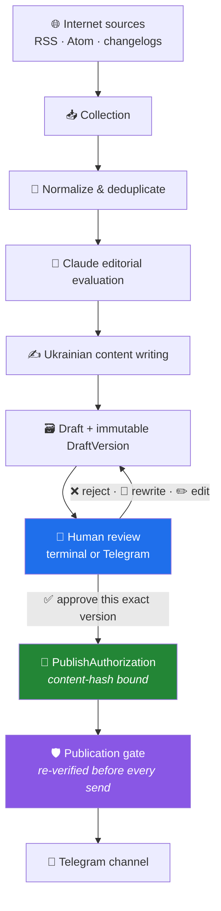
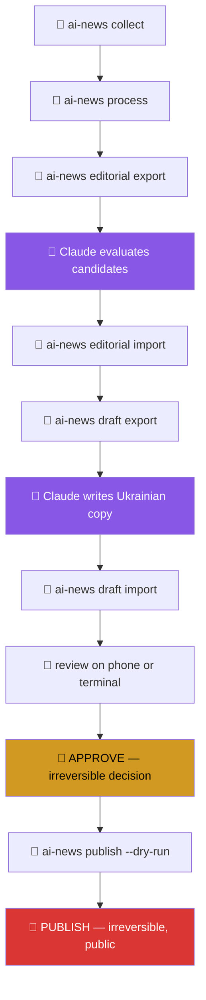

# 🤖 AI News Assistant — Human-in-the-Loop Telegram Editorial System

An AI-assisted **editorial pipeline** that discovers, evaluates, drafts, reviews and
safely publishes Ukrainian AI content to Telegram — built around a real channel,
[@learn_ai_easy](https://t.me/learn_ai_easy), written for ordinary readers rather than
engineers.

<div align="center">

`🐍 Python does the infrastructure` · `🧠 Claude Code does the editorial thinking` · `👤 a human approves every single post`

</div>

[](https://www.python.org/)
[](#-quality)
[](#-quality)
[](docs/safety.md)
[](https://docs.astral.sh/ruff/)

---

## 💡 What this actually is

It looks like a Telegram bot. It isn't.

It is a small **editorial system** with a hard safety boundary in the middle. Deterministic
Python handles everything that must be reliable — fetching, deduplication, provenance,
storage, delivery. A **Claude Code session acts as the editor and writer**, exchanging
JSON with the application. And no piece of content reaches the channel unless a person
has read that exact text and said yes to it.

> 🚫 **There is no external LLM API and no API key in this project.**
> Claude Code is the editorial *operator*, not a dependency. There is no auto-publish
> code path, and the setting that would enable one is rejected at startup.

The interesting engineering here is not "call a model and post the result". It is
everything that makes the answer to *"could something unapproved ever reach the channel?"*
provably **no** — immutable versions, content-hash-bound approvals, an unforgeable
authorization object, and a publication gate that re-checks reality at the last instant
before a network call.

---

## ✨ Key Features

| | |
|---|---|
| 📰 **Multi-source collection** | RSS, Atom and HTML changelogs with conditional GET and per-source fetch state |
| 🧹 **Normalization & deduplication** | Canonical URLs, text extraction, near-duplicate detection |
| 🔎 **Source provenance & trust tiers** | Every claim traces back to something findable |
| 🧠 **Claude-assisted editorial evaluation** | Candidates scored against a written rubric, not vibes |
| ✍️ **Ukrainian editorial writing workflow** | A documented voice, enforced by a style checker |
| 🌱 **NEWCOMER-first audience modelling** | Four audience tiers; jargon detection built in |
| ✨ **Source-backed tested prompts** | A prompt must rest on a real, findable demonstration |
| 💡 **Real-world use cases & lifehacks** | What someone actually did, retold — workflow and result |
| ✅ **Human-in-the-loop review** | Approve · Edit · Rewrite · Reject, from terminal or phone |
| 📱 **Private Telegram review bot** | Owner-only; strangers get four words and no data |
| 🔐 **Exact-DraftVersion approval** | Bound to a content hash covering the whole post bundle |
| 📸 **Rich media publication** | Photos, albums, captions — approved text never truncated |
| 📄 **PDF & document support** | Downloadable resources as their own recorded component |
| 💬 **First-comment publication** | Long prompts go to the linked discussion group |
| ♻️ **Idempotent publishing** | A unique partial index makes publish-exactly-once a database fact |
| 🧩 **Partial-failure recovery** | The main post is *never* re-sent; retries fill only the gaps |
| ❓ **UNCERTAIN-delivery protection** | An unknown outcome stops everything and calls a human |
| 🤐 **Token redaction everywhere** | Logs, output, exceptions, database, fixtures — all scrubbed |
| 🧪 **1,657 automated tests** | Including a safety suite that cannot be skipped by accident |

---

## 🖼 What it looks like

**A real review card**, exactly as the private bot sends it — a `PROMPT` post written for
readers with no prior AI experience:


**The publication log** after a real end-to-end publication to the test channel:


**Health check** — read-only, contacts nothing:


<details>
<summary>📊 More: pipeline funnel and a NEWS review card</summary>


</details>

> 🧾 These are **genuine captures** of the real CLI and the real renderer running against
> the project database — not mockups. The private channel id, bot username and local
> filesystem paths are redacted. No fabricated Telegram screenshots appear anywhere in
> this repository.

---

## 🧬 Content model

Six kinds of post, because a reader wants different things from each:

| Type | What it gives the reader |
|---|---|
| 📰 **NEWS** | Something that happened, explained without jargon |
| ✨ **TESTED PROMPT** | A prompt to copy — backed by a real demonstration |
| 🛠 **TESTED USE CASE** | What someone actually did with AI: workflow and result |
| 💡 **REAL USER LIFEHACK** | A small practical trick that survived contact with reality |
| 🧠 **EXPLAINER** | One concept, no assumed background — *ШІ простими словами* |
| 📚 **RESOURCE** | Something to keep: a checklist, cheat sheet or collection |

And four audience tiers, so a post knows who it is speaking to:

```
🌱 NEWCOMER  →  🙂 BEGINNER  →  👤 GENERAL  →  🧩 TECH_CURIOUS
   never assumes                              comfortable with
   prior AI use                               technical framing
```

`NEWCOMER` is the default. If a post cannot be understood by someone who has never opened
an AI chat, it is not ready.

---

## 🏗 Architecture



Everything left of the blue box is assistance. Everything right of it is consequence.
📖 **[Full architecture →](docs/architecture.md)**

---

## 🔐 Safety by Design

This is the part worth reading if you only read one thing.

- 🚫 **No auto-approval, no auto-publish.** Enforced by a test that walks the CLI's
  registered options and fails if `--yes`, `--all` or `--approve-all` ever appears.
- 🔗 **Exact version + content hash binding.** The hash covers the *whole* post — text,
  comment, media and footer. Change any of it and the approval stops verifying.
- 🧊 **Immutable version history.** SQLite triggers, not convention. "What did I approve
  on Tuesday?" is always answerable.
- ✏️ **Editing invalidates approval.** A new version returns the draft to review, in the
  same transaction that writes it.
- 🎫 **An unforgeable authorization.** `PublishAuthorization` refuses to construct outside
  the gate. A publisher can receive one; it can never make one.
- ⏱ **Re-verification at the last instant.** Every check runs again immediately before
  the network call, because minutes or days may have passed since approval.
- 📑 **Source-backed prompt policy.** A prompt without a findable demonstration cannot be
  published — and *approval cannot override this*.
- 📵 **Owner-only review bot.** Authorization runs before anything touches a draft. A
  stranger gets no card, no counts, no confirmation that anything exists.
- ♻️ **Publish exactly once.** A unique partial index; failed and uncertain attempts stay
  recordable because they are expected to repeat.
- 🧩 **Partial success is recorded, never smoothed over.** The main post is never re-sent.
- ❓ **UNCERTAIN stops everything.** A lost response means the outcome is unknown, so
  nothing is retried and a human checks the channel. An incomplete post beats a duplicate
  one, every time.
- 🧾 **External content is untrusted data.** Stored, quoted, attributed — never executed.
- 🤐 **The token is nowhere.** `SecretStr` plus a log filter that scrubs token-shaped
  strings from every record, including non-string values.

📖 **[Full safety documentation →](docs/safety.md)**

---

## 🧰 Tech Stack

| Layer | Choice | Why |
|---|---|---|
| 🐍 Language | **Python 3.11+** | `StrEnum`, `zoneinfo`, modern typing |
| 🧱 Models | **Pydantic v2** | `extra="forbid"`, frozen models, validators as invariants |
| 🗄 Storage | **SQLite** (stdlib `sqlite3`) | No ORM — hand-written ordered migrations with checksums |
| 💻 CLI | **Typer** + **Rich** | Readable commands, readable output |
| 🌐 HTTP | **httpx** | One HTTP library, `MockTransport` in every test |
| 📰 Feeds | **feedparser** | The RSS/Atom zoo, handled |
| 🔍 HTML | **selectolax** | Fast changelog parsing and text extraction |
| 📣 Delivery | **Telegram Bot API 10.2** | Verified against live docs, not from memory |
| 🧠 Editorial | **Claude Code** | The operator — no API client, no key |
| 🧪 Quality | **pytest** + **Ruff** | 1,657 tests; a safety suite that cannot be skipped |

**Zero LLM dependencies. Zero cloud dependencies. Zero paid services.**

---

## 📁 Project Structure

```text
src/ai_news_editor/
├── domain/         # 🧱 models, enums, content hashing, the authorization object
├── sources/        # 🌐 RSS/Atom/changelog fetching, conditional GET, fetch state
├── pipeline/       # 🧹 normalization, deduplication, screening
├── editorial/      # 🧠 candidate export → Claude evaluation → decision import
├── writing/        # ✍️ writing assignments, style checks, footer rendering
├── content/        # ✨ prompts, explainers, use cases, jargon detection
├── review/         # ✅ the human review service — the only path to a decision
├── publishing/     # 🛡 gate · plan · rich · service · Telegram client
├── bot/            # 📱 private owner-only review bot
├── storage/        # 🗄 repositories + ordered SQL migrations
├── observability/  # 🤐 structured logging with token redaction
└── cli/            # 💻 Typer commands

tests/
├── unit/           # fast, isolated
├── integration/    # real SQLite, real migrations
└── safety/         # 🔒 the invariants that must never regress

docs/
├── architecture.md      # 🏗 system design, data flow, publication safety
├── safety.md            # 🔐 every guarantee and how it is enforced
├── editorial_rubric.md  # 📊 how candidates are judged
├── telegram_style_guide.md  # 🎨 the channel's voice, in detail
└── screenshots/         # 🖼 real captures
```

---

## 🚀 Quick Start

**Requirements:** Python 3.11+ · macOS or Linux · no external services

```bash
git clone https://github.com/marine-ai-dev/ai_news_assistant_tg_bot.git
cd ai_news_assistant_tg_bot

python3.11 -m venv .venv
.venv/bin/pip install -e ".[dev]"
```

**Configure** — copy the template and fill in your own values:

```bash
cp .env.example .env
```

`.env` is git-ignored and must never be committed. Telegram settings are optional: the
whole pipeline up to review works without them.

**Initialize the database** (creates it and applies every migration):

```bash
.venv/bin/ai-news db init
```

**Check everything is healthy** — contacts nothing:

```bash
.venv/bin/ai-news doctor
```

**Run the tests:**

```bash
.venv/bin/pytest
```

### 💻 Main commands

| Command | What it does |
|---|---|
| `ai-news doctor` | 🩺 Local health check. No network. |
| `ai-news sources` | 🌐 Configured sources and their last fetch outcome |
| `ai-news collect` | 📥 Fetch sources, store new items |
| `ai-news process` | 🧹 Normalize and deduplicate into candidates |
| `ai-news status` | 📊 The pipeline funnel |
| `ai-news editorial export/import` | 🧠 Hand candidates to Claude, take decisions back |
| `ai-news draft export/import` | ✍️ Hand assignments to Claude, take drafts back |
| `ai-news content template/import` | ✨ Create prompts, explainers, use cases |
| `ai-news review` | ✅ Review drafts — approve, edit, rewrite, reject |
| `ai-news telegram doctor` | 🩺 Verify bot, channel and rights. Read-only. |
| `ai-news telegram review-bot` | 📱 Run the private review bot |
| `ai-news publish <draft-id>` | 📣 Publish one approved draft (`--dry-run` sends nothing) |
| `ai-news publication list` | 📜 The publication log |

---

## 🔄 Example workflow

Who does what, and which steps cannot be undone:



🐍 **grey** = deterministic Python · 🧠 **purple** = Claude Code editorial work ·
👤 **amber/red** = the two things only a human ever does

Steps 1–8 can be repeated freely. Step 10 puts words in front of readers and cannot be
taken back — which is why every guarantee in [safety.md](docs/safety.md) exists.

---

## 🧪 Quality

Measured at this commit, not aspirational:

- ✅ **1,657 automated tests**, all passing
- ✅ **94% total coverage**
- 🛡 **`publishing/gate.py` — 100% coverage** (the module that decides what may publish)
- 🛡 **Rich publication path — 100%** (`plan.py`, `rich.py`, `telegram.py`)
- 📱 **Review bot — 100%** (`review_bot.py`, `api.py`, `callbacks.py`, `session.py`)
- ✅ **Ruff clean**, zero warnings
- 🔒 A dedicated `tests/safety/` suite, marked so it cannot be skipped by accident
- 🌐 **No test touches the network** — every HTTP call goes through `httpx.MockTransport`

```bash
.venv/bin/pytest                                  # everything
.venv/bin/pytest -m safety                        # just the invariants
.venv/bin/pytest --cov=ai_news_editor             # with coverage
.venv/bin/ruff check .
```

---

## 🚦 Project Status

**Working today — a complete path from a URL to a published post.**

One real end-to-end publication has already succeeded against a private test channel,
through the full gate: approval bound to an exact version, re-verification before the
send, and a recorded message id.

| Area | State |
|---|---|
| 📥 Collection, normalization, deduplication | ✅ Working |
| 🧠 Claude editorial evaluation workflow | ✅ Working |
| ✍️ Ukrainian writing workflow, all content types | ✅ Working |
| ✅ Human review — CLI and Telegram | ✅ Working |
| 🔐 Approval gate and content-hash binding | ✅ Working |
| 📣 Telegram publication, including rich bundles | ✅ Working |
| 📸 Media, albums, PDFs, first comments | ✅ Working |
| 🧩 Partial-failure and UNCERTAIN handling | ✅ Working |
| 📅 Publication queue and scheduler | 🔜 In progress |

This is an actively developed personal project, not a finished v1. It is public because
the engineering is worth reading.

---

## 🗺 Roadmap

- 📅 **Publication queue & local scheduler** — schedule an approved post for a future
  time, with freshness policy per content type and an overdue policy that holds rather
  than publishes late
- 🗓 **Editorial calendar & content balancing** — variety across types, sources and
  audience tiers
- 📊 **Analytics foundation** — understand what actually helps readers

> 💰 Monetization is intentionally deferred until real audience data exists.

---

## 📣 The channel

Built around **[@learn_ai_easy](https://t.me/learn_ai_easy)** — a Ukrainian channel
explaining AI to people who are not engineers: from someone who has never opened an AI
chat, to someone curious about how the tools work.

That audience is a design constraint, not a marketing note. It is why jargon detection is
a code path, why `NEWCOMER` is the default tier, and why a prompt has to be backed by
someone actually running it.

---

## 📄 License

No license file yet — all rights reserved for now. If you want to use something here,
please open an issue and ask.

---

<div align="center">

*Built with deterministic Python, Claude Code as the editor, and a human who reads every
word before it goes out.* ✍️

</div>
