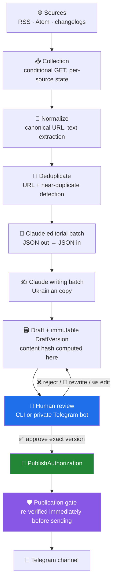
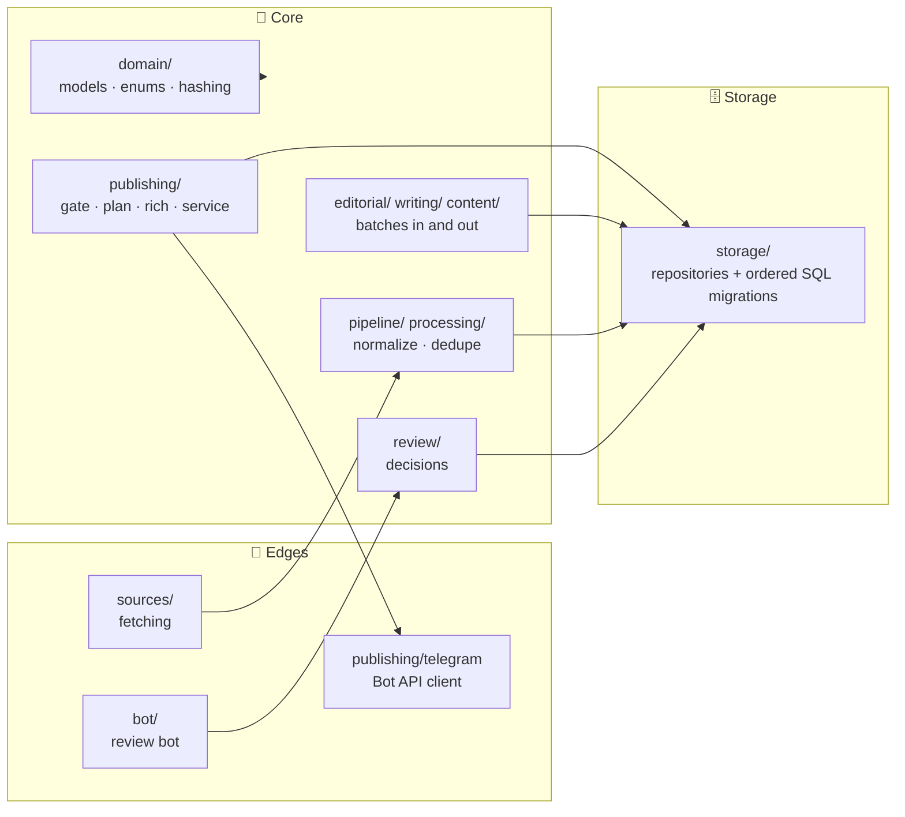
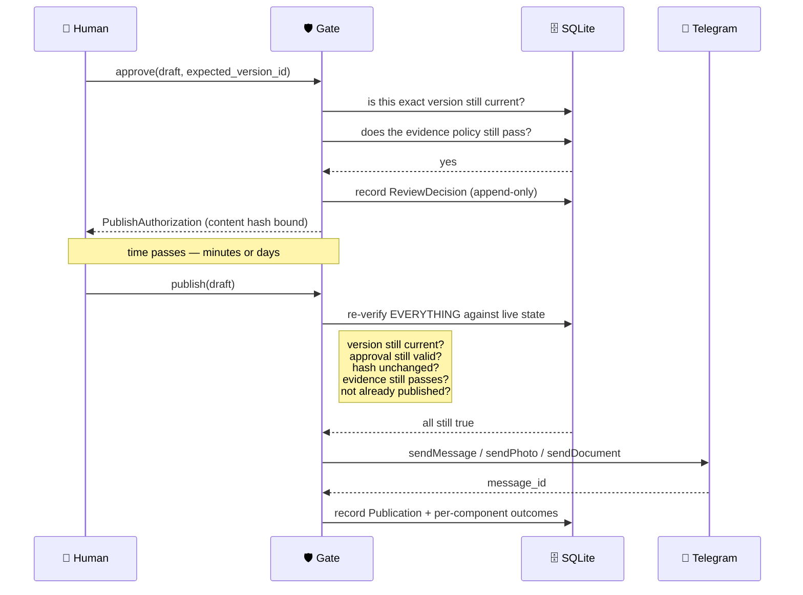
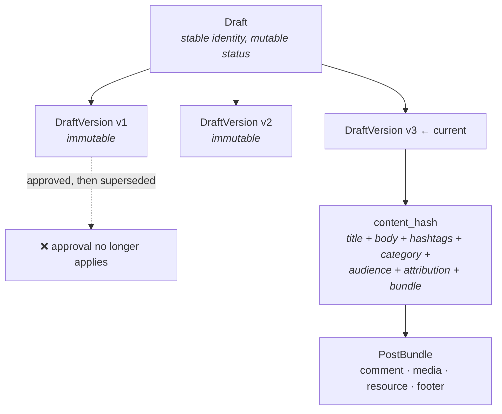
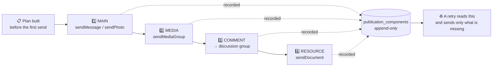

# 🏗 Architecture

How the system is put together, and why the boundaries fall where they do.

---

## 🧭 The one idea everything else follows from

Three different kinds of actor touch a post on its way to a channel, and they are
**never** allowed to do each other's jobs:

| Actor | Does | Never does |
|---|---|---|
| 🐍 **Python** | Fetches, normalises, deduplicates, stores, validates, sends | Decides what is good, writes prose, approves |
| 🧠 **Claude Code** | Evaluates candidates, writes Ukrainian copy, researches evidence | Approves, publishes, writes to the database directly |
| 👤 **Human** | Approves, rejects, edits, publishes | — (nothing is done on their behalf) |

Claude Code is the **editorial operator**, not an API integration. There is no LLM
client library in this repository and no API key: the editorial and writing layers are a
Claude Code session exchanging JSON files with the application.

---

## 🔄 End-to-end flow

The blue, green and purple boxes are the human-in-the-loop boundary. Nothing crosses
from `G` to `K` without a person having typed a decision about that exact version.

---

## 🧱 Layers

`domain/` has no dependency on storage, HTTP or Telegram. Everything that decides
whether something may be published lives in `publishing/gate.py`, and every publisher
goes through it.

---

## 🔐 The publication safety flow

This is the part worth reading closely.

Two properties fall out of this:

- **An approval is not a permit that travels forward in time.** It is a recorded fact
  about a specific version at a specific moment, re-checked in full at the last instant
  before anything leaves the machine.
- **A `PublishAuthorization` cannot be forged.** Its constructor refuses to run outside
  the gate — a `ContextVar` sentinel set only by `issue_publication_authorization()`. A
  publisher can receive one; it can never make one.

---

## 📦 The content model

A draft's **identity** is stable so it can be discussed and tracked. Its **content** is
immutable, so "what was approved" is always answerable. Editing appends a version and
returns the draft to `PENDING_REVIEW`; the old approval does not follow it.

The `content_hash` covers the **whole bundle**, not just the text. Change the comment,
swap an image, edit the footer — the hash moves and the approval stops verifying.

---

## 📨 Rich publication: several messages, no transaction

Telegram has no transaction across messages. A post with an image, a first comment and
a downloadable PDF is four API calls, and any of them can fail independently.

- The **plan is decided before the first call**, so a dry run is the same function a
  real run uses — not a description of it.
- Every component is recorded as it completes. **The main post is never sent twice**: a
  resumed publication sees `MAIN → SUCCEEDED` and skips it.
- A component whose outcome is *unknown* blocks the whole resume. A duplicate post on a
  channel is visible to readers and cannot be undone; a missing comment is an annoyance.
  The system always prefers the annoyance.

---

## 🗄 Storage

Plain `sqlite3` from the standard library, with hand-written ordered SQL migrations and
checksums. No ORM.

- **WAL** mode, foreign keys enforced.
- **Append-only tables** guarded by triggers: `raw_items`, `draft_versions`,
  `review_decisions`, `publications`, `publication_components`. A record that can be
  rewritten cannot answer "did that post actually go out?".
- **A unique partial index** enforces publish-exactly-once: one exact `draft_version_id`
  may succeed at most once per destination. Failed and uncertain attempts stay
  recordable, because they are expected to repeat.

---

## 🚫 What is deliberately absent

| Not here | Why |
|---|---|
| An LLM API client | Claude Code is the operator, not a dependency |
| An ORM | The schema is the point; migrations are read as prose |
| A task queue / broker | One person, one Mac, one channel |
| An auto-publish flag | There is a setting, and it is rejected at startup |
| A "publish all" command | Every publication names exactly one draft |
